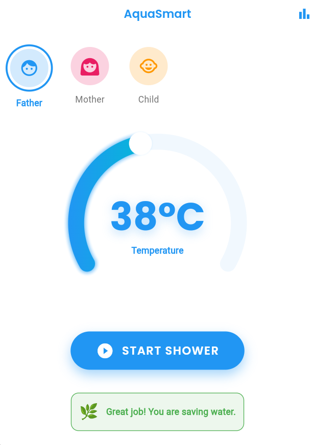
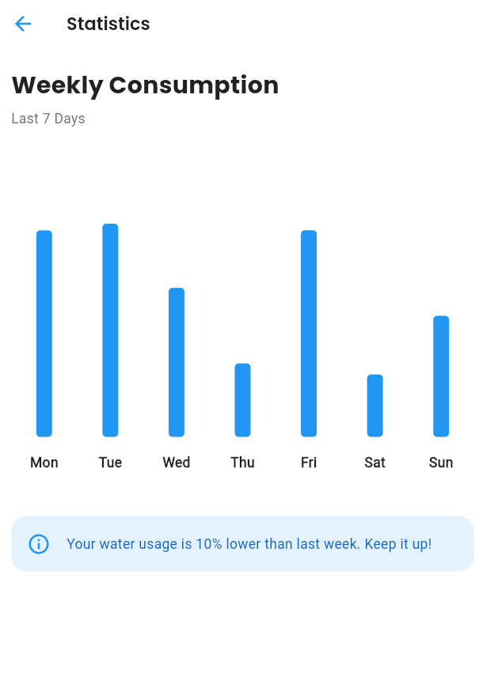

# AquaSmart – Smart Water Temperature Control System

AquaSmart is a complete smart water management system combining:

- 📱 Mobile application (Flutter MVP)
- 🔌 ESP32-S2 embedded control unit
- 💧 Flow and temperature sensor hardware
- ⚙️ Closed-loop PI-based temperature control
- 🌐 WiFi-based remote communication

This repository includes both the mobile demo application and the embedded hardware/firmware design.

# AquaSmart Flutter MVP

Demo mobile application for checking water consumption and controlling temperature.

## Project Structure
```
lib/
├── main.dart                  # Entry point
├── src/
│   ├── app.dart               # Material App setup
│   ├── constants/
│   │   └── app_theme.dart     # Colors and Fonts
│   ├── models/
│   │   └── models.dart        # Data Models
│   ├── providers/
│   │   └── water_control_provider.dart # State Management (Mock Data)
│   └── ui/
│       ├── dashboard/
│       │   ├── dashboard_screen.dart
│       │   └── widgets/       # Dashboard specific widgets
│       └── stats/
│           ├── stats_screen.dart
│           └── widgets/       # Chart widgets
```

## Features & Screens

### 1. Dashboard (Main Screen)
The heart of the application, designed for easy control and monitoring.
- **Modern Temperature Control**: A sleek, large circular slider to set your target water temperature (20°C - 60°C).
- **Profile Switching**: 
  - Switch between **Father**, **Mother**, and **Child** profiles.
  - **Randomized Data**: Each profile has its own unique consumption habits and history. Switching profiles instantly refreshes the data to demonstrate personalization.
- **Smart Efficiency Alert**: visual feedback (Green Banner) when the temperature is set to an eco-friendly level (<40°C).
- **"Start Shower" Simulation Mode**: 
  - **Demo Feature**: Press the large **"START SHOWER"** button to simulate a live shower session.
  - **Real-Time Tracking**: Watch the *Session Liters* and *Cost* rise second-by-second (simulating 9L/min flow).
  - **Live Cost Calculation**: Costs are calculated dynamically based on usage.




### 2. Statistics
- **Weekly Consumption**: A clear bar chart showing water usage for the last 7 days.
- **Interactive Labels**: Dark, readable text showing days of the week.
- **Insight**: Helpful text summaries (e.g., "10% lower than last week").




### 3. Architecture & Tech Stack
- **State Management**: Built with `flutter_riverpod` for robust and reactive state.
- **Mock Data Engine**: A sophisticated simulation engine (`WaterControlNotifier`) that generates realistic usage data and handles the time-based shower simulation.
- **Charts**: Uses `fl_chart` for beautiful, animated graphical data.

## How to Run

1. **Install Dependencies**:
   Navigate to the project directory in your terminal:
   ```bash
   cd c:\Users\hy092\Desktop\AQUASMART
   flutter pub get
   ```

2. **Run the App**:
   ```bash
   flutter run
   ```

## Dependencies
- `flutter_riverpod`: State Management
- `fl_chart`: Statistics Charts
- `sleek_circular_slider`: Temperature Control UI
- `google_fonts`: Typography
- `intl`: Formatting

## Embedded System Extension

In addition to the Flutter mobile application, this repository includes the complete embedded hardware and firmware design of the AquaSmart smart water control system.

### Hardware Design

- KiCad schematic-level design
- 12V protected power input stage
- LM2596 buck converter (5V generation)
- 3.3V regulation for ESP32-S2 logic
- MOSFET-based solenoid valve drivers
- DS18B20 digital temperature sensor (1-Wire)
- YF-S201 Hall-effect flow sensor
- SSD1306 I2C OLED display
- Rotary encoder user interface

### Firmware (ESP32-S2)

- Arduino-based embedded implementation
- Closed-loop PI temperature control
- Flow-based feed-forward compensation
- Time-proportional solenoid valve actuation
- Real-time water consumption calculation
- Overheat and sensor-fault protection logic
- HTTP API for remote mobile integration

### System Architecture

The AquaSmart system operates using a closed-loop control architecture:

1. The user sets a target temperature via the mobile application or rotary encoder interface.
2. The DS18B20 sensor provides real-time water temperature feedback.
3. The YF-S201 sensor measures instantaneous water flow and cumulative consumption.
4. The ESP32-S2 executes a PI-based control algorithm with flow-dependent compensation.
5. Solenoid valves are driven using time-proportional control to regulate the hot/cold mixing ratio.
6. System status, temperature, and consumption data are transmitted via HTTP API to the mobile interface.

This architecture enables stable temperature regulation, efficient water usage, and real-time monitoring within a full-stack IoT prototype.
